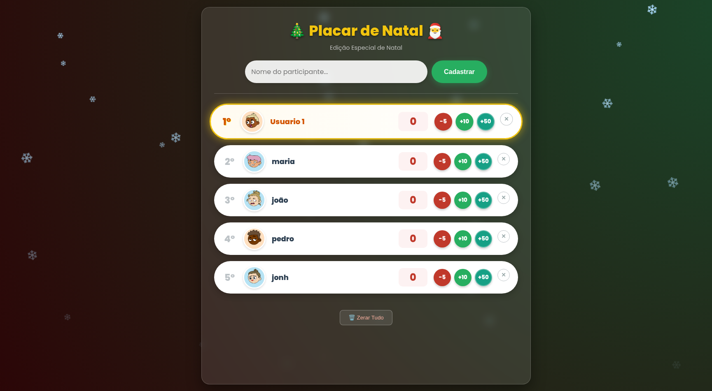

# 🎄 Placar de Natal - Leaderboard Interativo


> Um sistema de pontuação (Leaderboard) desenvolvido para gerenciar brincadeiras e jogos em festas de família (Natal e Ano Novo), com foco em experiência visual imersiva para TV e persistência de dados offline.


*(Adicione um print do seu projeto aqui salvo como screenshot.png)*

## 📋 Sobre o Projeto

Este projeto é uma **Web Application** focada em resolver um problema comum em reuniões familiares: gerenciar a pontuação dos jogos de forma justa, visual e divertida. 

O sistema foi projetado para ser exibido em uma tela grande (TV ou Projetor) enquanto é operado por um moderador. Ele utiliza **Local Storage** para garantir que os dados não sejam perdidos caso o navegador seja fechado acidentalmente.

## ✨ Funcionalidades

-   **🎨 UI Festiva (Dark Mode):** Interface com tema "Christmas Night" utilizando gradientes, Glassmorphism (efeito de vidro) e animações suaves.
-   **❄️ Efeitos Visuais:** Animação de neve caindo processada via CSS/JS.
-   **🤖 Avatars Automáticos:** Integração com a **API DiceBear** para gerar avatares únicos e divertidos para cada participante cadastrado.
-   **🏆 Ranking em Tempo Real:** A lista se reordena automaticamente (sort) sempre que a pontuação de um jogador muda, mantendo o líder sempre no topo com destaque dourado.
-   **💾 Persistência de Dados:** Uso da API `localStorage` do navegador para salvar, editar e excluir participantes sem necessidade de banco de dados externo.
-   **⚡ Controles Rápidos:** Botões de ação (+10, +50, -5) para agilidade durante os jogos.

## 🛠️ Tecnologias Utilizadas

* **HTML5:** Estrutura semântica.
* **CSS3:** Variáveis CSS (`:root`), Flexbox para layout, `@keyframes` para animações (neve) e design responsivo.
* **JavaScript (ES6+):** Manipulação do DOM, Lógica de ordenação de Arrays, Fetch/Consumo de API e LocalStorage.
* **API:** [DiceBear](https://dicebear.com/) (Geração de Avatars).

## 🚀 Como Executar

Este é um projeto estático, não requer instalação de dependências (npm/node).

1.  Clone este repositório:
    ```bash
    git clone https://silasgoncalvesczs.github.io/placar/(https://silasgoncalvesczs.github.io/placar/)
    ```
2.  Abra o arquivo `index.html` em qualquer navegador moderno.

**Dica:** Você pode hospedar gratuitamente via **GitHub Pages** (Settings > Pages > Branch: Main).

## 🎮 Guia de Uso (Para o dia da Festa)

Para garantir a melhor experiência na hora das brincadeiras:

1.  **Conexão:** Conecte o notebook à TV via cabo HDMI.
2.  **Tela Cheia:** Abra o site e pressione `F11` (Windows) ou `Cmd + Shift + F` (Mac) para o navegador ocupar a tela toda.
3.  **Ajuste de Zoom:** Se a TV estiver longe, segure a tecla `CTRL` e aperte `+` várias vezes para aumentar a interface até ficar legível para todos.
4.  **Som:** O sistema é visual, então recomenda-se deixar uma playlist de Natal tocando no fundo (Spotify/YouTube) na mesma máquina.

---

Desenvolvido com ❤️ por SILAS GONÇALVES